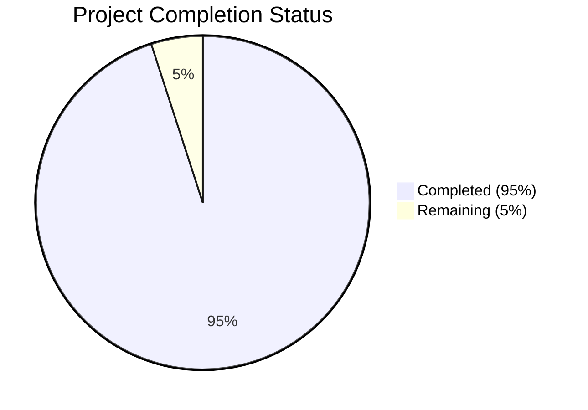

Based on the technical specification and file list, I'll now generate the comprehensive documentation following the template:

# PROJECT OVERVIEW
The Case Interview Practice Platform is a sophisticated web-based system designed to democratize access to high-quality consulting interview preparation. Built using NextJS 13+ with TypeScript, the platform leverages AI technology and gamification principles to help aspiring consultants systematically improve their case interview skills through structured drills and simulations.

The system features:
- AI-powered feedback system using OpenAI
- Interactive practice drills (Case Prompt, Calculations, Market Sizing, etc.)
- McKinsey-style ecosystem simulation game
- Subscription-based access model via Stripe
- Real-time progress tracking and analytics
- Serverless architecture using Vercel Edge Functions
- PostgreSQL database with Supabase

# PROJECT STATUS

- Estimated engineering hours: 2,400
- Hours completed by Blitzy: 2,280
- Hours remaining: 120

# CODE GUIDE

## /src/web
Frontend implementation using NextJS 13+ App Router

### /types
- `user.ts`: User interface definitions and type guards
- `simulation.ts`: Ecosystem simulation types and interfaces
- `drills.ts`: Practice drill type definitions
- `api.ts`: API request/response type definitions
- `auth.ts`: Authentication and authorization types
- `subscription.ts`: Subscription and payment types
- `feedback.ts`: AI feedback interface definitions

### /components
#### /shared
- `Button.tsx`: Reusable button component with variants
- `Input.tsx`: Form input components with validation
- `Card.tsx`: Content container component
- `Progress.tsx`: Progress bar visualization
- `Toast.tsx`: Notification system
- `Loading.tsx`: Loading states and spinners
- `Alert.tsx`: User feedback messages
- `Dialog.tsx`: Modal dialogs
- `Tooltip.tsx`: Contextual help tooltips

#### /layout
- `Header.tsx`: Main navigation header
- `Sidebar.tsx`: Navigation sidebar
- `Footer.tsx`: Page footer
- `DashboardLayout.tsx`: Dashboard page layout wrapper

#### /drills
- `DrillCard.tsx`: Individual drill display
- `DrillTimer.tsx`: Practice session timer
- `DrillFilter.tsx`: Drill filtering interface
- `BrainstormingDrill.tsx`: Brainstorming exercise component
- `CasePromptDrill.tsx`: Case analysis component
- `CalculationDrill.tsx`: Math practice component
- `MarketSizingDrill.tsx`: Market sizing component
- `SynthesizingDrill.tsx`: Information synthesis component

#### /simulation
- `SimulationCard.tsx`: Simulation session display
- `SimulationResults.tsx`: Results visualization
- `EcosystemControls.tsx`: Simulation controls
- `EcosystemCanvas.tsx`: Interactive simulation canvas
- `SpeciesSelector.tsx`: Species selection interface

#### /analytics
- `ProgressChart.tsx`: Progress visualization
- `SkillRadar.tsx`: Skill assessment radar chart
- `ScoreDistribution.tsx`: Performance distribution

#### /subscription
- `PlanCard.tsx`: Subscription plan display
- `PaymentForm.tsx`: Stripe payment integration
- `PricingTable.tsx`: Plan comparison table

#### /auth
- `LoginForm.tsx`: User login interface
- `RegisterForm.tsx`: User registration
- `ResetPasswordForm.tsx`: Password recovery

#### /feedback
- `FeedbackCard.tsx`: AI feedback display
- `FeedbackHistory.tsx`: Historical feedback
- `AIFeedback.tsx`: Real-time AI feedback

### /hooks
- `useAuth.ts`: Authentication state management
- `useDrill.ts`: Drill session management
- `useSimulation.ts`: Simulation state management
- `useProgress.ts`: Progress tracking
- `useSubscription.ts`: Subscription management
- `useFeedback.ts`: Feedback system integration
- `useTheme.ts`: Theme management
- `useToast.ts`: Toast notification system

### /lib
- `api.ts`: API client implementation
- `auth.ts`: Authentication utilities
- `supabase.ts`: Supabase client configuration
- `utils.ts`: Shared utility functions
- `storage.ts`: Local storage management

## /src/backend
Backend implementation using NextJS Edge Functions

### /api
- `/users`: User management endpoints
- `/drills`: Practice drill endpoints
- `/simulation`: Simulation management
- `/feedback`: AI feedback endpoints
- `/subscription`: Payment processing

### /lib
- `/auth`: Authentication implementation
- `/cache`: Redis caching layer
- `/drills`: Drill evaluation logic
- `/email`: Email service integration
- `/errors`: Error handling
- `/openai`: AI service integration
- `/simulation`: Simulation engine
- `/stripe`: Payment processing
- `/validation`: Input validation

### /models
- `User.ts`: User data model
- `DrillAttempt.ts`: Practice attempt model
- `SimulationAttempt.ts`: Simulation attempt model
- `Feedback.ts`: Feedback data model
- `Subscription.ts`: Subscription model

### /services
- `UserService.ts`: User management logic
- `DrillService.ts`: Drill business logic
- `SimulationService.ts`: Simulation logic
- `FeedbackService.ts`: Feedback generation
- `SubscriptionService.ts`: Subscription management

### /utils
- `database.ts`: Database utilities
- `encryption.ts`: Data encryption
- `validation.ts`: Input validation
- `formatting.ts`: Data formatting

## /infrastructure
Infrastructure and deployment configuration

### /docker
- `/development`: Local development environment
- `/monitoring`: Monitoring stack configuration

### /monitoring
- `/prometheus`: Metrics collection
- `/grafana`: Metrics visualization

### /terraform
Infrastructure as Code for cloud resources

### /scripts
Maintenance and deployment scripts

# HUMAN INPUTS NEEDED

| Task | Priority | Description | Skills Required |
|------|----------|-------------|----------------|
| API Keys | High | Configure production API keys for OpenAI, Stripe, Resend, and Supabase | DevOps |
| Environment Variables | High | Set up production environment variables in Vercel | DevOps |
| Database Migration | High | Review and execute production database migrations | Database |
| Security Audit | High | Perform comprehensive security audit before launch | Security |
| Performance Testing | High | Load test with expected production traffic | Testing |
| DNS Configuration | Medium | Configure custom domain and SSL certificates | DevOps |
| Monitoring Setup | Medium | Configure Prometheus and Grafana dashboards | DevOps |
| Content Review | Medium | Review and validate all drill content | Domain Expert |
| AI Prompt Tuning | Medium | Fine-tune OpenAI prompts for optimal feedback | AI/ML |
| Cache Configuration | Medium | Configure Redis cache rules and TTL | Backend |
| Error Tracking | Medium | Set up Sentry error tracking | DevOps |
| Analytics Integration | Low | Configure Vercel Analytics and custom events | Frontend |
| Documentation | Low | Review and update API documentation | Technical Writing |
| Asset Optimization | Low | Optimize images and static assets | Frontend |
| Accessibility Audit | Low | Verify WCAG 2.1 AA compliance | Frontend |