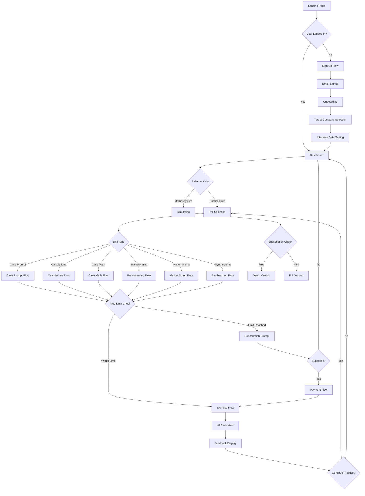
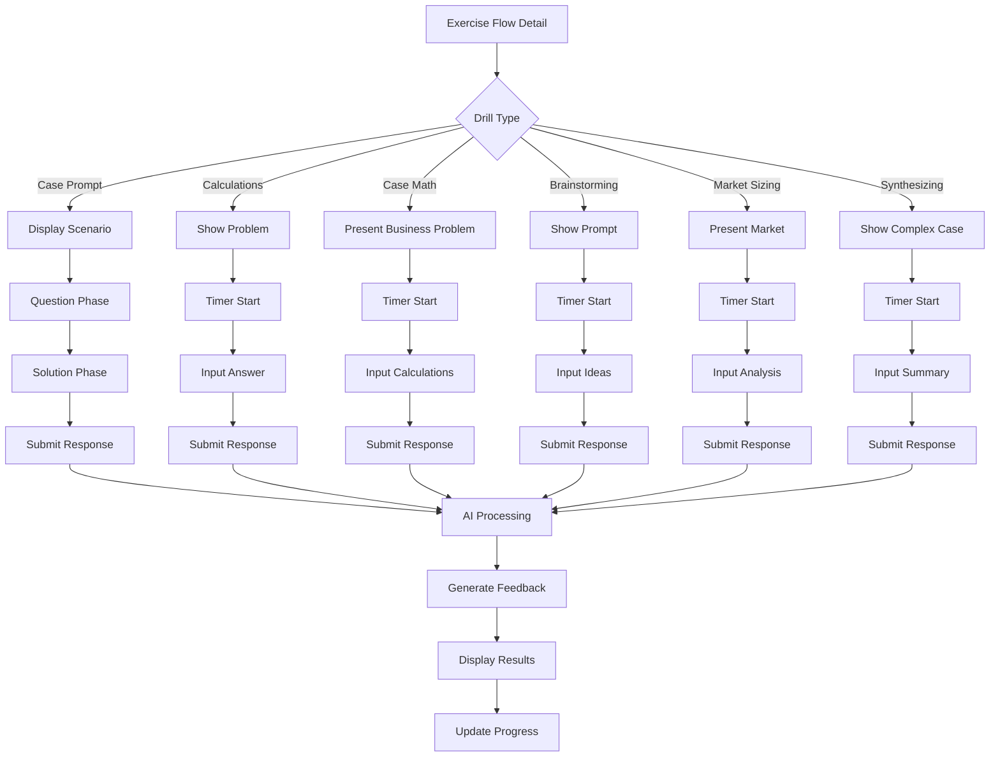
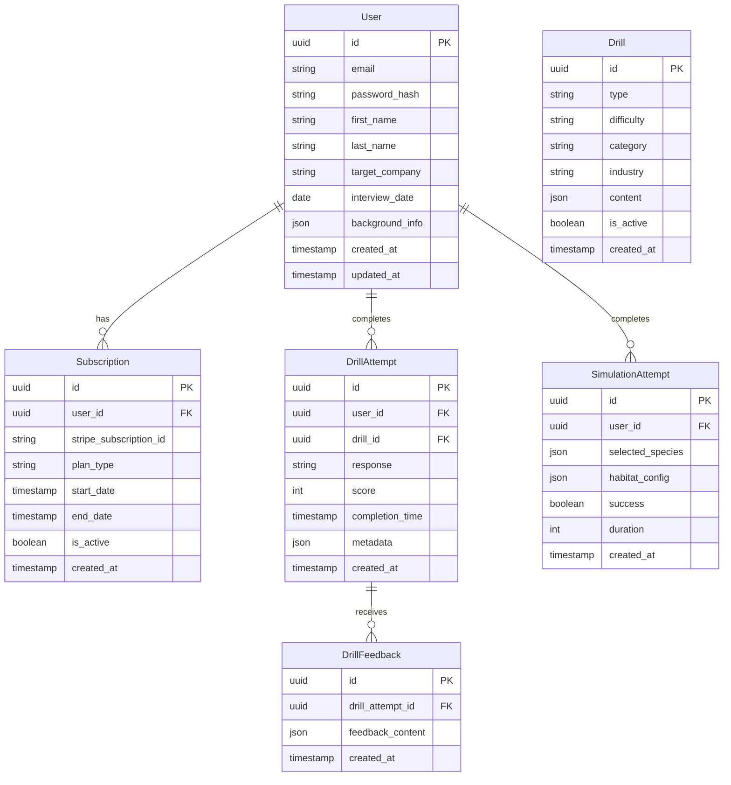
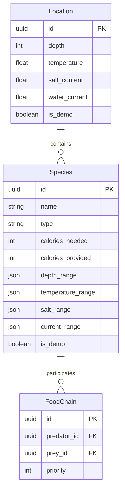
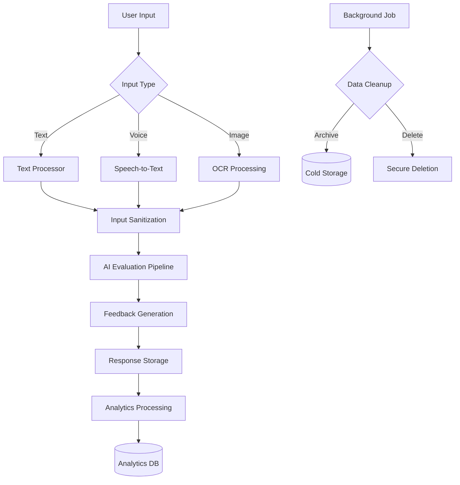
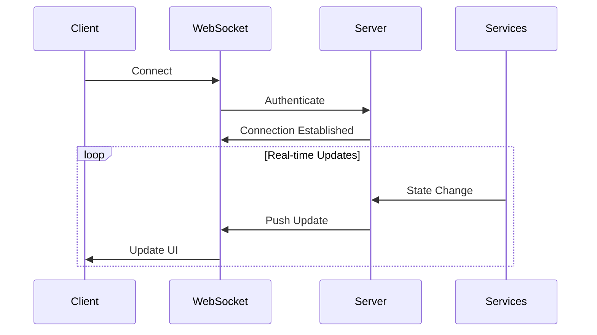

# 1. Introduction

## 1.1 Purpose

This Software Requirements Specification (SRS) document provides a comprehensive description of the case interview practice platform. It details the functional and non-functional requirements for developers, project managers, and stakeholders involved in the platform's development and deployment. The document serves as the authoritative reference for technical implementation and acceptance criteria.

## 1.2 Scope

The platform is a web-based application designed to help aspiring consultants prepare for case interviews at top consulting firms. Key functionalities include:

- Six core drill types targeting essential case interview skills:
  - Case Prompt Drills
  - Calculations Drills
  - Case Math Drills
  - Brainstorming Drills
  - Market Sizing Drills
  - Synthesizing Drills

- McKinsey Eco-System Game Simulator replicating digital assessment

- Core features:
  - User authentication and profile management
  - Subscription-based access tiers
  - AI-powered feedback and evaluation
  - Progress tracking and performance analytics
  - Interview countdown and preparation timeline
  - Personalized learning paths based on target employers

The platform aims to:
- Democratize access to high-quality case interview preparation
- Provide consistent, objective feedback through AI evaluation
- Create a gamified learning experience that maintains engagement
- Enable structured skill development across key consulting competencies
- Deliver a scalable practice environment for mass user adoption

# 2. Product Description

## 2.1 Product Perspective

The case interview practice platform operates as a standalone web application built on NextJS and React, integrating with several external services:

- Supabase for database, authentication, and file storage
- Stripe for payment processing
- OpenAI services for AI-powered feedback and evaluation
- Resend for email communications

The system architecture follows a modern serverless approach using NextJS edge functions and Vercel hosting, eliminating the need for traditional server infrastructure.

## 2.2 Product Functions

The platform provides these core functions:

1. **Drill Practice System**
   - Six distinct drill types targeting specific case interview skills
   - AI-powered evaluation and feedback
   - Progress tracking and performance analytics
   - Customizable difficulty levels and configurations

2. **McKinsey Assessment Simulation**
   - Digital ecosystem game replication
   - Time-pressured decision making
   - Complex data analysis scenarios
   - Real-time feedback on solutions

3. **User Management**
   - Profile creation and customization
   - Interview date tracking
   - Target employer preferences
   - Progress monitoring

4. **Subscription Management**
   - Tiered access control
   - Payment processing
   - Subscription status tracking
   - Upgrade pathways

## 2.3 User Characteristics

Primary user personas include:

1. **College Student**
   - Age: 20-22
   - Technical proficiency: High
   - Available time: 10-15 hours/week
   - Budget conscious
   - Seeking entry-level consulting positions

2. **MBA Candidate**
   - Age: 26-32
   - Technical proficiency: Moderate to high
   - Available time: 5-10 hours/week
   - Higher budget tolerance
   - Targeting post-MBA consulting roles

3. **Career Switcher**
   - Age: 25-35
   - Technical proficiency: Moderate
   - Available time: 5-8 hours/week
   - Value-focused
   - Pursuing consulting transition

## 2.4 Constraints

1. **Technical Constraints**
   - Browser compatibility requirements (Chrome, Safari, Firefox, Edge)
   - Mobile responsiveness limitations for complex simulations
   - API rate limits from OpenAI services
   - Supabase database size limitations

2. **Business Constraints**
   - Subscription pricing ceiling based on market research
   - Marketing budget limitations
   - Development team size
   - Time-to-market pressure

3. **Legal Constraints**
   - GDPR compliance requirements
   - CCPA compliance requirements
   - Payment processing regulations
   - Data protection standards

## 2.5 Assumptions and Dependencies

**Assumptions**

1. Users have:
   - Stable internet connection
   - Modern web browser
   - Basic computer literacy
   - English language proficiency

2. Technical:
   - OpenAI API maintains current capability levels
   - Supabase continues supporting current features
   - Stripe maintains current fee structure

**Dependencies**

1. External Services:
   - OpenAI API availability
   - Supabase platform stability
   - Stripe payment processing
   - Vercel hosting reliability
   - Resend email delivery

2. Development:
   - NextJS framework updates
   - React library maintenance
   - TailwindCSS compatibility
   - Shadcn component library support

3. Business:
   - Consulting firm interview processes remain similar
   - Market demand for case interview preparation
   - Competitive pricing environment stability

## PROCESS FLOWCHART





# 3. Functional Requirements

## 3.1 Core Features

### F1: User Authentication and Management

**Description**: System for user registration, login, and profile management.

**Priority**: High

| ID | Requirement | Details |
|----|-------------|---------|
| F1.1 | Email Registration | - Collect email and password<br>- Validate email format<br>- Check for existing accounts<br>- Send verification email |
| F1.2 | Social Authentication | - Support Google OAuth<br>- Link social accounts to existing profiles |
| F1.3 | Profile Management | - Update personal information<br>- Set target companies<br>- Schedule interview dates<br>- Upload profile picture |
| F1.4 | Password Management | - Reset via email link<br>- Change password functionality<br>- Password strength requirements |

### F2: Drill System

**Description**: Core practice drill functionality across six types.

**Priority**: High

| ID | Requirement | Details |
|----|-------------|---------|
| F2.1 | Drill Selection | - Filter by type, difficulty, industry<br>- Display completion status<br>- Show estimated duration |
| F2.2 | Drill Execution | - Timer functionality<br>- Progress tracking<br>- Save partial progress<br>- Multiple input methods (text, voice, image) |
| F2.3 | AI Evaluation | - Real-time response analysis<br>- Scoring based on drill criteria<br>- Detailed feedback generation |
| F2.4 | Results Display | - Show score and breakdown<br>- Provide sample solutions<br>- Offer improvement suggestions |

### F3: McKinsey Simulation

**Description**: Digital assessment simulation environment.

**Priority**: Medium

| ID | Requirement | Details |
|----|-------------|---------|
| F3.1 | Game Setup | - Species selection interface<br>- Habitat configuration<br>- Timer initialization |
| F3.2 | Simulation Engine | - Food chain calculations<br>- Environmental parameter tracking<br>- Real-time validation |
| F3.3 | Results Processing | - Success/failure determination<br>- Detailed feedback generation<br>- Performance metrics |

### F4: Subscription Management

**Description**: Payment processing and access control system.

**Priority**: High

| ID | Requirement | Details |
|----|-------------|---------|
| F4.1 | Plan Management | - Display subscription options<br>- Process upgrades/downgrades<br>- Handle renewals |
| F4.2 | Payment Processing | - Stripe integration<br>- Support multiple currencies<br>- Handle failed payments |
| F4.3 | Access Control | - Limit free tier usage<br>- Grant premium features<br>- Manage subscription status |

### F5: Progress Tracking

**Description**: System for monitoring user performance and improvement.

**Priority**: Medium

| ID | Requirement | Details |
|----|-------------|---------|
| F5.1 | Performance Analytics | - Track completion rates<br>- Calculate success metrics<br>- Generate trend analysis |
| F5.2 | Progress Dashboard | - Visual performance graphs<br>- Drill type breakdown<br>- Improvement suggestions |
| F5.3 | Interview Preparation | - Countdown to interview<br>- Recommended practice schedule<br>- Preparation milestones |

### F6: AI Feedback System

**Description**: Automated evaluation and feedback generation.

**Priority**: High

| ID | Requirement | Details |
|----|-------------|---------|
| F6.1 | Response Analysis | - Process text/voice input<br>- Apply scoring criteria<br>- Generate feedback points |
| F6.2 | Feedback Generation | - Provide specific improvements<br>- Show sample solutions<br>- Highlight strengths/weaknesses |
| F6.3 | Performance Tracking | - Store historical feedback<br>- Track improvement patterns<br>- Generate trend analysis |

# 4. Non-Functional Requirements

## 4.1 Performance Requirements

| Category | Requirement | Target Metric |
|----------|-------------|---------------|
| Response Time | API Endpoint Response | < 200ms for 95% of requests |
| Response Time | Page Load Time | < 2s initial load, < 500ms subsequent loads |
| Response Time | AI Feedback Generation | < 5s for drill evaluation |
| Throughput | Concurrent Users | Support 1000+ simultaneous users |
| Resource Usage | Client Memory | < 100MB RAM usage |
| Resource Usage | Database Queries | < 50ms query execution time |
| Resource Usage | Edge Function Execution | < 50ms execution time |

## 4.2 Safety Requirements

| Category | Requirement | Implementation |
|----------|-------------|----------------|
| Data Backup | Regular Backups | - Daily automated Supabase backups<br>- 30-day retention period<br>- Point-in-time recovery capability |
| Failure Recovery | System Resilience | - Automatic failover for critical services<br>- Graceful degradation of non-critical features<br>- Error boundary implementation in React components |
| Data Loss Prevention | Progress Protection | - Auto-save every 30 seconds during drills<br>- Local storage backup of user input<br>- Session recovery after connection loss |
| System Monitoring | Health Checks | - Real-time performance monitoring<br>- Automated alert system<br>- Error logging and tracking |

## 4.3 Security Requirements

| Category | Requirement | Implementation |
|----------|-------------|----------------|
| Authentication | User Identity | - Email verification required<br>- Strong password policy<br>- OAuth 2.0 social login<br>- JWT token management |
| Authorization | Access Control | - Role-based access control<br>- Subscription tier enforcement<br>- API route protection<br>- Resource access validation |
| Data Protection | Encryption | - Data-at-rest encryption<br>- TLS 1.3 for data in transit<br>- Secure cookie handling<br>- PII encryption |
| Privacy | User Data | - GDPR compliance tools<br>- Data deletion capability<br>- Privacy policy enforcement<br>- Data access logs |

## 4.4 Quality Requirements

| Category | Requirement | Target Metric |
|----------|-------------|---------------|
| Availability | System Uptime | 99.9% availability |
| Maintainability | Code Quality | - 80% test coverage<br>- Automated CI/CD pipeline<br>- Documentation requirements<br>- Code review process |
| Usability | User Experience | - Mobile-responsive design<br>- WCAG 2.1 AA compliance<br>- < 3 clicks to core features<br>- Intuitive navigation |
| Scalability | Growth Support | - Support 100% user growth per month<br>- Horizontal scaling capability<br>- CDN implementation<br>- Database partitioning |
| Reliability | Error Rate | - < 0.1% error rate for critical operations<br>- < 1% drill evaluation errors<br>- Zero data loss guarantee |

## 4.5 Compliance Requirements

| Category | Requirement | Implementation |
|----------|-------------|----------------|
| Data Privacy | GDPR | - User consent management<br>- Data portability<br>- Right to be forgotten<br>- Privacy policy compliance |
| Regional | CCPA | - California privacy rights<br>- Data collection disclosure<br>- Opt-out mechanisms |
| Financial | PCI DSS | - Secure payment processing<br>- Card data handling<br>- Audit trail maintenance |
| Accessibility | WCAG | - Screen reader compatibility<br>- Keyboard navigation<br>- Color contrast requirements<br>- Alt text for images |
| Industry | ISO 27001 | - Information security management<br>- Risk assessment procedures<br>- Security controls implementation |

# 5. Data Requirements

## 5.1 Data Models

### Core Entities Relationship Diagram



### Simulation Data Model



## 5.2 Data Storage

### Primary Storage (Supabase PostgreSQL)

| Data Category | Retention Period | Backup Frequency | Storage Type |
|---------------|------------------|------------------|--------------|
| User Data | Indefinite | Daily | Hot Storage |
| Drill Attempts | 12 months | Daily | Hot Storage |
| Simulation Attempts | 6 months | Daily | Warm Storage |
| Analytics Data | 24 months | Weekly | Cold Storage |
| System Logs | 3 months | Weekly | Cold Storage |

### Backup Strategy

- **Real-time Replication**
  - Continuous streaming replication to standby database
  - Automatic failover capability
  - 99.99% data consistency guarantee

- **Point-in-Time Recovery**
  - WAL (Write-Ahead Logging) retention: 7 days
  - Hourly incremental backups
  - Daily full backups
  - 30-day backup retention

### Data Redundancy

- Geographic redundancy across three regions
- Multi-AZ deployment within each region
- Read replicas for high-traffic regions

## 5.3 Data Processing

### Data Flow Diagram



### Security Measures

| Layer | Security Control | Implementation |
|-------|-----------------|----------------|
| Transport | Data in Transit | - TLS 1.3 encryption<br>- Perfect forward secrecy<br>- Certificate pinning |
| Storage | Data at Rest | - AES-256 encryption<br>- Key rotation every 90 days<br>- Encrypted backups |
| Application | Access Control | - Row-level security<br>- Column encryption<br>- JWT validation |
| Database | Query Protection | - Prepared statements<br>- Query timeouts<br>- Connection pooling |

### Data Processing Rules

1. **Input Processing**
   - Sanitize all user inputs
   - Validate against XSS and SQL injection
   - Convert to standardized format

2. **AI Processing**
   - Rate limit API calls
   - Cache common responses
   - Implement retry logic

3. **Analytics Processing**
   - Aggregate hourly
   - Anonymize personal data
   - Implement data sampling

4. **Cleanup Processing**
   - Archive after retention period
   - Secure deletion verification
   - Maintain audit trail

# 6. External Interfaces

## 6.1 User Interfaces

### 6.1.1 General Requirements

| Requirement | Implementation |
|-------------|----------------|
| Responsive Design | - Breakpoints: 320px, 768px, 1024px, 1440px<br>- Mobile-first approach<br>- Fluid typography scaling<br>- Flexible grid layouts |
| Accessibility | - WCAG 2.1 AA compliance<br>- Screen reader compatibility<br>- Keyboard navigation support<br>- Minimum contrast ratio 4.5:1 |
| Theme Support | - Light/dark mode toggle<br>- System preference detection<br>- Consistent color variables<br>- Shadcn theming integration |

### 6.1.2 Core Interface Components

| Component | Requirements |
|-----------|--------------|
| Navigation | - Persistent top navigation bar<br>- Collapsible side menu on mobile<br>- Breadcrumb navigation<br>- Progress indicators |
| Forms | - Real-time validation<br>- Error messaging<br>- Autosave functionality<br>- Progress preservation |
| Modals | - Keyboard dismissible<br>- Backdrop blur effect<br>- Mobile-optimized sizing<br>- Focus trap implementation |
| Feedback | - Toast notifications<br>- Loading states<br>- Error boundaries<br>- Success confirmations |

### 6.1.3 Drill Interface Requirements

| Feature | Specifications |
|---------|---------------|
| Timer Display | - Countdown visualization<br>- Color-coded time warnings<br>- Pause/resume controls<br>- Time remaining alerts |
| Input Methods | - Rich text editor<br>- Voice input recorder<br>- Image upload interface<br>- Mathematical expression editor |
| Progress Tracking | - Completion percentage<br>- Step indicators<br>- Save state markers<br>- Resume capability |

## 6.2 Software Interfaces

### 6.2.1 External Service Integration

| Service | Interface Type | Purpose |
|---------|---------------|----------|
| OpenAI | REST API | - Response evaluation<br>- Feedback generation<br>- Voice transcription<br>- Image analysis |
| Stripe | REST API + SDK | - Payment processing<br>- Subscription management<br>- Invoice generation<br>- Refund handling |
| Supabase | SDK + WebSocket | - Data persistence<br>- Real-time updates<br>- Authentication<br>- File storage |
| Resend | REST API | - Email notifications<br>- Verification emails<br>- Password resets<br>- System alerts |

### 6.2.2 API Specifications

```typescript
interface APIResponse {
  success: boolean;
  data?: any;
  error?: {
    code: string;
    message: string;
    details?: any;
  };
  metadata: {
    timestamp: string;
    requestId: string;
  };
}

interface APIError extends Error {
  code: string;
  details?: any;
  requestId: string;
}
```

### 6.2.3 Integration Requirements

| Component | Requirements |
|-----------|--------------|
| Error Handling | - Retry logic with exponential backoff<br>- Fallback mechanisms<br>- Error reporting<br>- Circuit breaker implementation |
| Rate Limiting | - Request queuing<br>- Token bucket algorithm<br>- Priority handling<br>- Quota management |
| Caching | - Redis implementation<br>- Cache invalidation rules<br>- TTL configuration<br>- Stale-while-revalidate |

## 6.3 Communication Interfaces

### 6.3.1 Network Requirements

| Category | Specification |
|----------|--------------|
| Protocol | - HTTPS (TLS 1.3)<br>- WebSocket (WSS)<br>- HTTP/2 support<br>- gRPC for internal services |
| Data Format | - JSON for REST APIs<br>- Protocol Buffers for gRPC<br>- MessagePack for WebSocket<br>- UTF-8 encoding |
| Security | - CORS policy enforcement<br>- API key authentication<br>- JWT token validation<br>- Rate limiting |

### 6.3.2 Real-time Communication



### 6.3.3 Integration Patterns

| Pattern | Implementation |
|---------|----------------|
| Pub/Sub | - Topic-based messaging<br>- Message persistence<br>- Delivery guarantees<br>- Dead letter queues |
| Event Sourcing | - Event store<br>- Event replay capability<br>- Versioning support<br>- Snapshot management |
| CQRS | - Command validation<br>- Query optimization<br>- Read/write separation<br>- Cache integration |

# APPENDICES

## A. GLOSSARY

| Term | Definition |
|------|------------|
| Case Interview | A job interview focused on analyzing and solving business problems in real-time |
| Drill | A focused practice exercise targeting specific case interview skills |
| MECE | Mutually Exclusive, Collectively Exhaustive - a problem-solving framework |
| Market Sizing | Estimation technique to determine total market value or volume |
| Break Even | Point at which total revenue equals total costs |
| Case Math | Quantitative analysis specific to business case scenarios |
| Synthesizing | Process of combining information to form coherent conclusions |
| Food Chain | Hierarchical relationship between species in ecosystem simulation |

## B. ACRONYMS

| Acronym | Expansion |
|---------|-----------|
| API | Application Programming Interface |
| CCPA | California Consumer Privacy Act |
| CORS | Cross-Origin Resource Sharing |
| CQRS | Command Query Responsibility Segregation |
| GDPR | General Data Protection Regulation |
| JWT | JSON Web Token |
| MECE | Mutually Exclusive, Collectively Exhaustive |
| ORM | Object-Relational Mapping |
| PCI DSS | Payment Card Industry Data Security Standard |
| SQL | Structured Query Language |
| SRS | Software Requirements Specification |
| TLS | Transport Layer Security |
| TTL | Time To Live |
| UI | User Interface |
| WCAG | Web Content Accessibility Guidelines |
| WSS | WebSocket Secure |
| YoY | Year over Year |

## C. ADDITIONAL REFERENCES

### Technical Documentation

| Resource | Purpose |
|----------|----------|
| [NextJS Documentation](https://nextjs.org/docs) | Framework reference |
| [Supabase Documentation](https://supabase.io/docs) | Database and authentication |
| [Stripe API Reference](https://stripe.com/docs/api) | Payment integration |
| [OpenAI API Documentation](https://platform.openai.com/docs) | AI integration |
| [Shadcn Documentation](https://ui.shadcn.com) | UI components |

### Business References

| Resource | Purpose |
|----------|----------|
| McKinsey Digital Assessment Guide | Simulation reference |
| Case Interview Frameworks | Drill structure reference |
| Consulting Math Guidelines | Calculation drill reference |
| Market Sizing Methodologies | Market sizing drill reference |

## D. IMPLEMENTATION NOTES

### Development Environment Setup

```bash
# Required environment variables
NEXT_PUBLIC_SUPABASE_URL=
NEXT_PUBLIC_SUPABASE_ANON_KEY=
STRIPE_SECRET_KEY=
OPENAI_API_KEY=
RESEND_API_KEY=

# Development commands
npm run dev     # Start development server
npm run build   # Production build
npm run test    # Run test suite
```

### Database Initialization

```sql
-- Core tables initialization
CREATE TABLE users (
  id UUID PRIMARY KEY DEFAULT uuid_generate_v4(),
  email TEXT UNIQUE NOT NULL,
  created_at TIMESTAMP WITH TIME ZONE DEFAULT TIMEZONE('utc'::text, NOW())
);

CREATE TABLE subscriptions (
  id UUID PRIMARY KEY DEFAULT uuid_generate_v4(),
  user_id UUID REFERENCES users(id),
  stripe_subscription_id TEXT UNIQUE,
  created_at TIMESTAMP WITH TIME ZONE DEFAULT TIMEZONE('utc'::text, NOW())
);
```

### API Rate Limits

| Service | Free Tier | Paid Tier |
|---------|-----------|------------|
| OpenAI | 3 requests/minute | 60 requests/minute |
| Drill Attempts | 2 per type | Unlimited |
| Simulation | Demo version only | Full version |