# 1. EXECUTIVE SUMMARY

The Case Interview Practice Platform is a web-based system designed to democratize access to high-quality consulting interview preparation. By leveraging AI technology and gamification principles, the platform enables aspiring consultants to systematically practice and improve their case interview skills through structured drills and simulations. Primary users include college students and MBA candidates targeting positions at top consulting firms like McKinsey, Bain, and BCG.

The platform addresses the critical gap between theoretical case preparation and practical interview performance by providing consistent, objective feedback through AI evaluation. This scalable approach allows users to practice extensively with immediate feedback, significantly improving their preparation efficiency compared to traditional peer practice methods.

# 2. SYSTEM OVERVIEW

## Project Context

| Aspect | Details |
|--------|----------|
| Market Position | First-mover in AI-powered case interview preparation |
| Target Market | College/MBA students preparing for consulting interviews |
| Competitive Advantage | AI-powered feedback, structured drill system, McKinsey simulation |
| Market Gap | Limited options for systematic, scalable interview practice |

## High-Level Description

| Component | Implementation |
|-----------|----------------|
| Frontend | NextJS/React single-page application |
| Backend | Serverless architecture via NextJS edge functions |
| Core Services | AI evaluation, subscription management, progress tracking |
| Data Storage | Supabase (PostgreSQL) with real-time capabilities |
| External Services | OpenAI, Stripe, Resend |

## Success Criteria

| Metric | Target |
|--------|---------|
| User Engagement | >80% completion rate for started drills |
| System Performance | <200ms API response time for 95% of requests |
| User Satisfaction | >4.5/5 average feedback score |
| Platform Stability | 99.9% uptime during peak usage |

# 3. SCOPE

## In-Scope Elements

### Core Features

| Feature Category | Components |
|-----------------|------------|
| Practice Drills | - Case Prompt Drills<br>- Calculations Drills<br>- Case Math Drills<br>- Brainstorming Drills<br>- Market Sizing Drills<br>- Synthesizing Drills |
| McKinsey Simulation | - Ecosystem game replication<br>- Time-pressured scenarios<br>- Complex data analysis |
| User Management | - Profile customization<br>- Progress tracking<br>- Performance analytics |
| Subscription System | - Tiered access control<br>- Payment processing<br>- Account management |

### Implementation Boundaries

| Boundary Type | Coverage |
|--------------|----------|
| User Groups | College students, MBA candidates, career switchers |
| Geographic Coverage | Global access, English language only |
| Platform Support | Web browsers (Chrome, Safari, Firefox, Edge) |
| Data Scope | User profiles, practice attempts, performance metrics |

## Out-of-Scope Elements

| Category | Excluded Elements |
|----------|------------------|
| Features | - Mobile applications<br>- Offline mode<br>- Live coaching sessions<br>- Peer matching system |
| Languages | - Non-English content<br>- Multi-language support |
| Integrations | - University career portals<br>- Job application systems<br>- Video conferencing tools |
| Support | - 24/7 live support<br>- Phone support<br>- In-person training |

Future phase considerations include mobile applications, additional language support, and integration with university career portals. These elements, while valuable, are not part of the initial system implementation to ensure focused delivery of core functionality.

# 5. SYSTEM ARCHITECTURE

## 5.1 High-Level Architecture

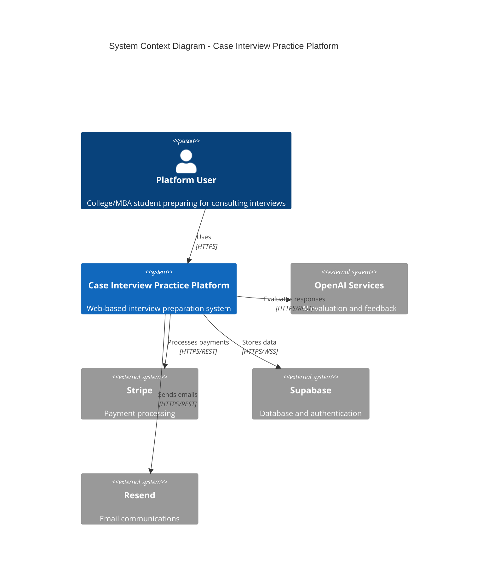

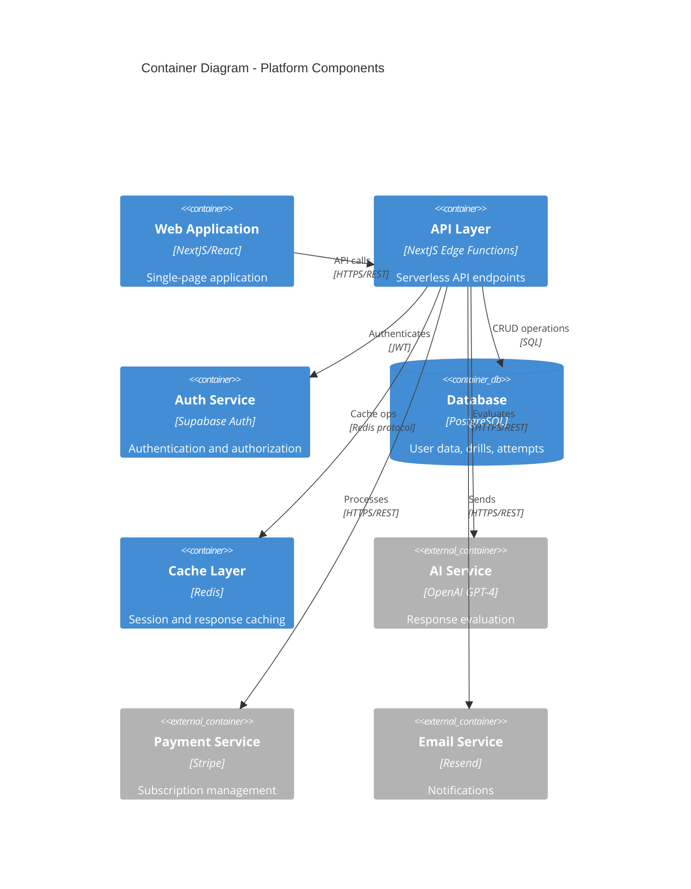

## 5.2 Component Details

### Web Application (Frontend)
- **Technology**: NextJS 13+ (App Router) with React
- **Key Components**:
  - Drill Engine: Manages practice session state
  - Simulation Engine: Handles ecosystem game logic
  - Progress Tracker: Monitors user advancement
  - Real-time Feedback: Displays AI evaluations
- **Data Flow**: Client-side state management with React Context
- **Scaling**: Edge network distribution via Vercel

### API Layer
- **Technology**: NextJS Edge Functions
- **Key Endpoints**:
  - `/api/drills`: Practice session management
  - `/api/simulation`: Ecosystem game operations
  - `/api/auth`: Authentication operations
  - `/api/subscription`: Payment handling
- **Scaling**: Automatic scaling via edge network
- **Response Times**: Target <200ms for 95th percentile

### Database Layer
- **Technology**: Supabase (PostgreSQL)
- **Key Tables**:
  - Users & Profiles
  - Drill Attempts & Results
  - Simulation Data
  - Subscription Status
- **Scaling**: Horizontal read replicas
- **Backup**: Daily snapshots, point-in-time recovery

## 5.3 Technical Decisions

### Architecture Style
- **Monolithic NextJS Application**
  - Justification: Simplified deployment, reduced complexity
  - Benefits: Shared codebase, unified testing
  - Tradeoffs: Limited service isolation

### Communication Patterns
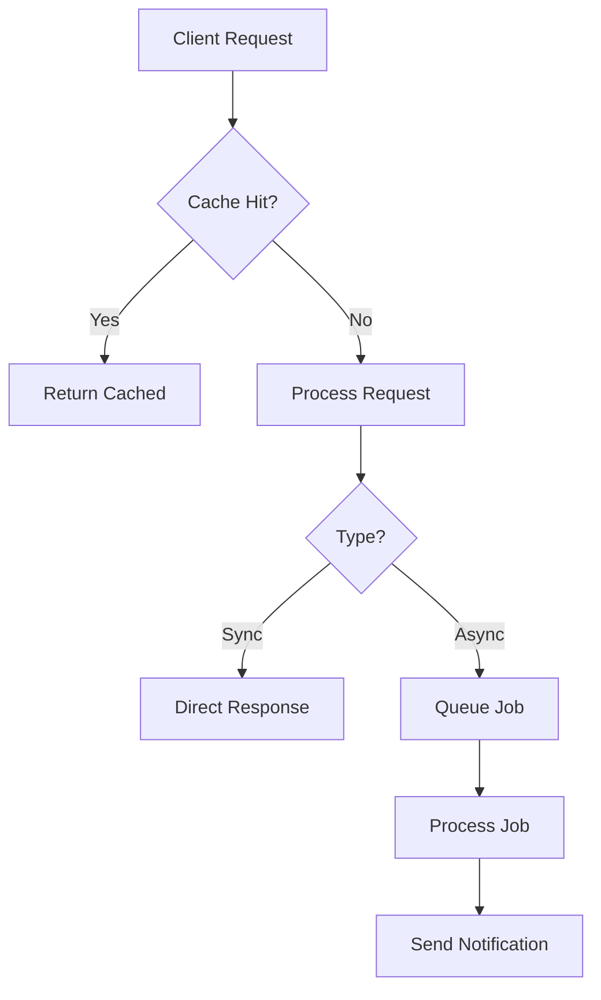

### Caching Strategy
- **Multi-Level Caching**:
  1. Browser Cache: Static assets
  2. CDN Cache: Page data
  3. Redis Cache: API responses
  - TTL: 5 minutes for drill data
  - Invalidation: On content update

## 5.4 Cross-Cutting Concerns

### Monitoring & Observability
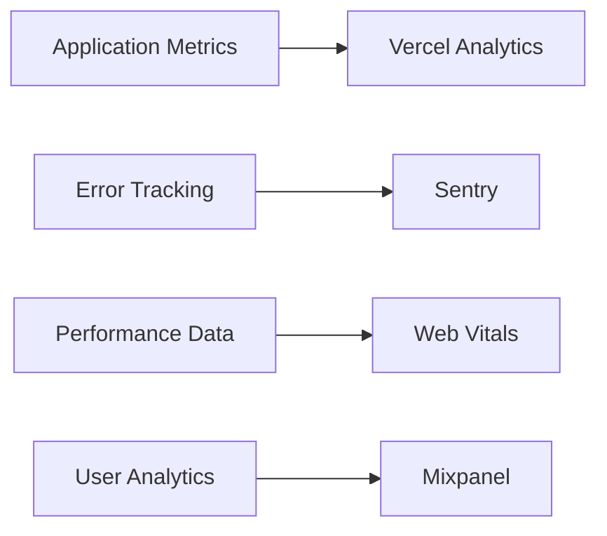

### Security Architecture
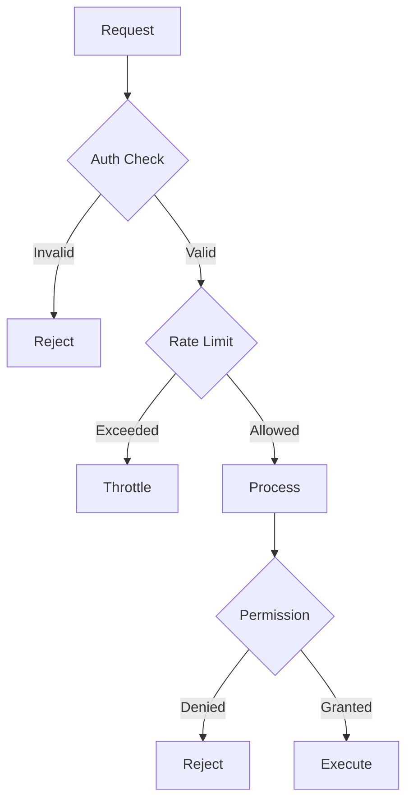

## 5.5 Deployment Architecture

```mermaid
C4Deployment
    title Deployment Diagram - Production Environment

    Deployment_Node(cdn, "CDN", "Vercel Edge Network") {
        Container(static, "Static Assets", "Next.js static files")
    }
    
    Deployment_Node(compute, "Compute Layer", "Vercel Serverless") {
        Container(app, "Application", "Next.js App")
        Container(api, "API Functions", "Edge Functions")
    }
    
    Deployment_Node(data, "Data Layer", "Supabase") {
        ContainerDb(db, "Database", "PostgreSQL")
        Container(auth, "Auth Service", "Supabase Auth")
    }
    
    Deployment_Node(cache, "Cache Layer", "Redis Enterprise") {
        Container(redis, "Redis Cache", "Response Cache")
    }

    Rel(cdn, compute, "Routes requests", "HTTPS")
    Rel(compute, data, "Persists data", "HTTPS")
    Rel(compute, cache, "Caches responses", "Redis protocol")
```

## 5.6 Data Flow Architecture

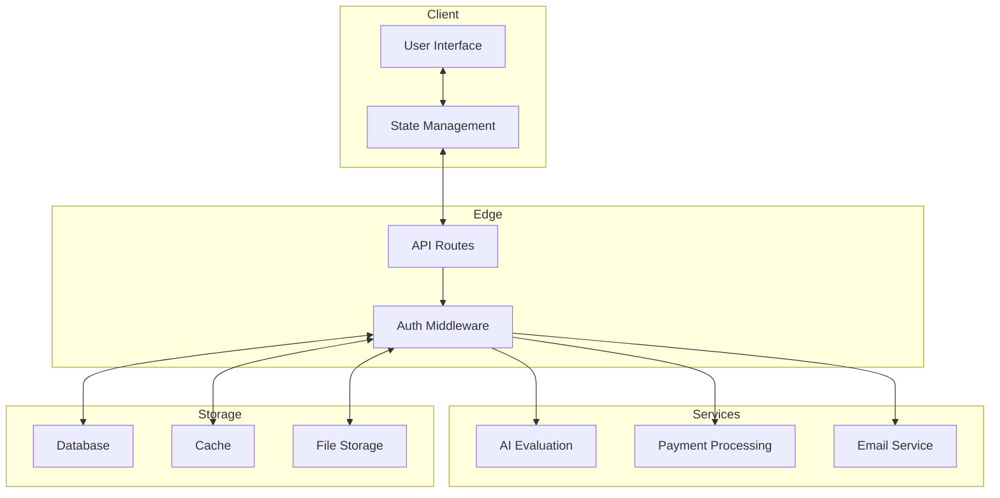

# 7. SYSTEM DESIGN

## 7.1 User Interface Design

### 7.1.1 Design System Specifications

| Component | Specification |
|-----------|--------------|
| Typography | - Primary: Inter<br>- Secondary: Roboto Mono<br>- Scale: 12/14/16/20/24/32/48px |
| Color Palette | - Primary: #0F172A<br>- Secondary: #3B82F6<br>- Accent: #22C55E<br>- Error: #EF4444<br>- Warning: #F59E0B |
| Spacing | - Base unit: 4px<br>- Scale: 4/8/12/16/24/32/48/64px |
| Breakpoints | - Mobile: 320px<br>- Tablet: 768px<br>- Desktop: 1024px<br>- Wide: 1440px |
| Shadows | - sm: 0 1px 2px rgba(0,0,0,0.05)<br>- md: 0 4px 6px rgba(0,0,0,0.1)<br>- lg: 0 10px 15px rgba(0,0,0,0.1) |

### 7.1.2 Component Library

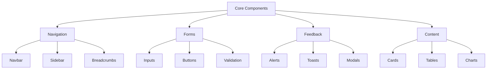

### 7.1.3 Critical User Flows

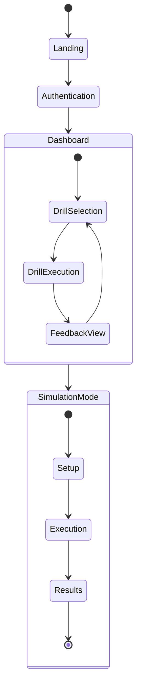

### 7.1.4 Accessibility Requirements

| Category | Requirements |
|----------|--------------|
| Standards | WCAG 2.1 AA compliant |
| Keyboard | - Full keyboard navigation<br>- Focus indicators<br>- Skip links |
| Screen Readers | - ARIA labels<br>- Semantic HTML<br>- Alt text for images |
| Color | - Minimum contrast 4.5:1<br>- Color-independent information<br>- High contrast mode |

## 7.2 Database Design

### 7.2.1 Schema Design

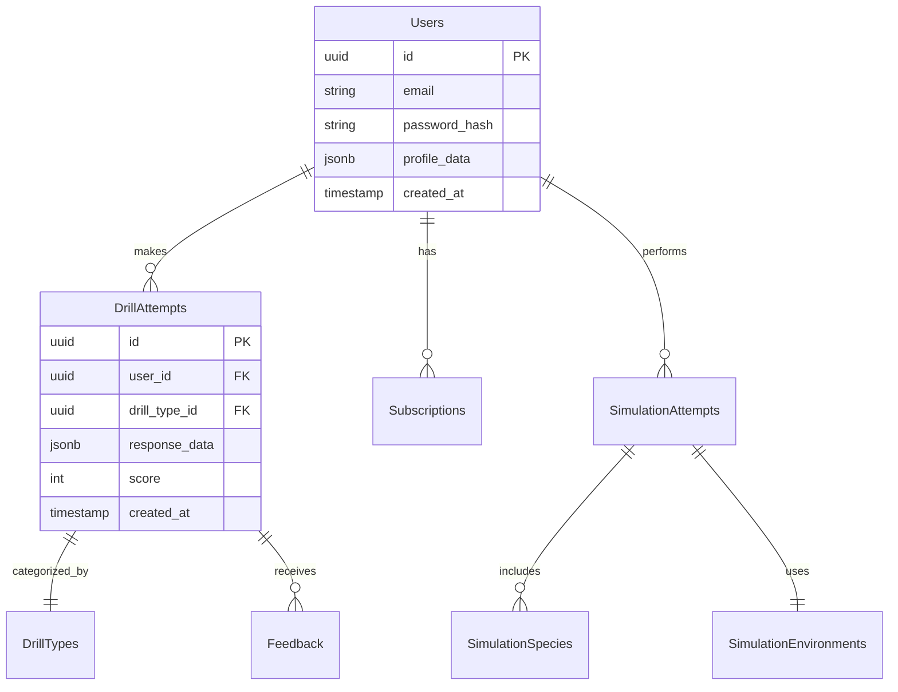

### 7.2.2 Indexing Strategy

| Table | Index Type | Columns | Purpose |
|-------|------------|---------|----------|
| Users | B-tree | email | Login lookups |
| DrillAttempts | B-tree | (user_id, created_at) | Performance history |
| SimulationAttempts | B-tree | (user_id, success) | Success tracking |
| Feedback | GiST | response_text | Full-text search |

### 7.2.3 Partitioning Strategy

```sql
-- Partition DrillAttempts by month
CREATE TABLE drill_attempts (
    id uuid NOT NULL,
    created_at timestamp NOT NULL
) PARTITION BY RANGE (created_at);

-- Create monthly partitions
CREATE TABLE drill_attempts_y2024m01 
    PARTITION OF drill_attempts
    FOR VALUES FROM ('2024-01-01') TO ('2024-02-01');
```

## 7.3 API Design

### 7.3.1 API Architecture

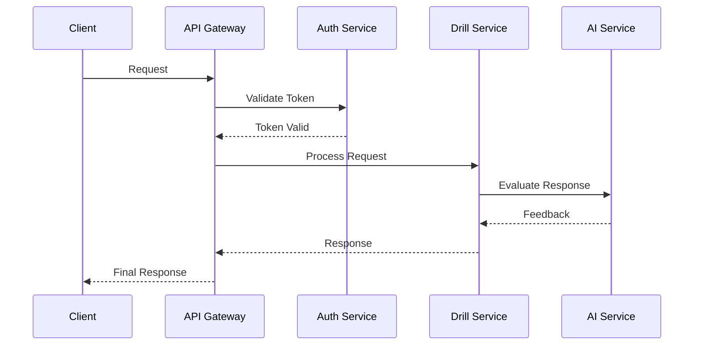

### 7.3.2 Endpoint Specifications

| Endpoint | Method | Purpose | Auth Required |
|----------|--------|---------|---------------|
| /api/drills | GET | List available drills | Yes |
| /api/drills/:id | POST | Submit drill attempt | Yes |
| /api/simulation | POST | Start simulation | Yes |
| /api/feedback | GET | Retrieve feedback | Yes |

### 7.3.3 Authentication Flow

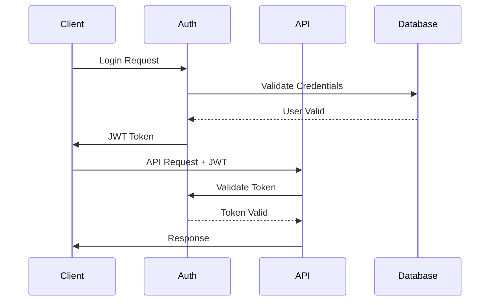

### 7.3.4 Rate Limiting

| Tier | Limit | Window | Burst |
|------|-------|--------|--------|
| Free | 60 | 1 hour | 5 |
| Basic | 300 | 1 hour | 10 |
| Premium | 1000 | 1 hour | 20 |

### 7.3.5 Error Handling

```typescript
interface APIError {
    code: string;
    message: string;
    details?: Record<string, any>;
    timestamp: string;
    requestId: string;
}

enum ErrorCodes {
    VALIDATION_ERROR = 'VALIDATION_ERROR',
    AUTHENTICATION_ERROR = 'AUTHENTICATION_ERROR',
    RATE_LIMIT_ERROR = 'RATE_LIMIT_ERROR',
    INTERNAL_ERROR = 'INTERNAL_ERROR'
}
```

### 7.3.6 Security Controls

| Control | Implementation |
|---------|----------------|
| Authentication | JWT with RSA-256 |
| Rate Limiting | Token bucket algorithm |
| Input Validation | JSON Schema validation |
| Output Sanitization | HTML escape, XSS prevention |
| CORS | Whitelist allowed origins |
| API Keys | Required for external services |

# 4. TECHNOLOGY STACK

## 4.1 PROGRAMMING LANGUAGES

| Platform/Component | Language | Version | Justification |
|-------------------|----------|---------|---------------|
| Frontend | TypeScript | 5.0+ | - Strong typing for complex drill logic<br>- Enhanced IDE support<br>- Better maintainability for large codebase |
| Backend | TypeScript | 5.0+ | - Code sharing with frontend<br>- Consistent development experience<br>- Native NextJS support |
| Build Tools | Node.js | 18.0+ LTS | - Required for NextJS<br>- Stable LTS support<br>- Extensive package ecosystem |

## 4.2 FRAMEWORKS & LIBRARIES

### Core Frameworks

| Framework | Version | Purpose | Justification |
|-----------|---------|---------|---------------|
| NextJS | 13+ (App Router) | Full-stack framework | - Server-side rendering<br>- Edge function support<br>- Built-in API routes<br>- Optimized build system |
| React | 18+ | UI library | - Component reusability<br>- Virtual DOM performance<br>- Rich ecosystem<br>- Native NextJS integration |
| TailwindCSS | 3+ | Styling | - Utility-first approach<br>- Built-in responsiveness<br>- Performance optimization<br>- Design system support |

### Supporting Libraries

| Category | Library | Version | Purpose |
|----------|---------|---------|---------|
| UI Components | shadcn/ui | Latest | - Accessible components<br>- Tailwind integration<br>- Customizable theming |
| Forms | react-hook-form | 7+ | - Performance optimization<br>- Form validation<br>- TypeScript support |
| Data Fetching | SWR | 2+ | - Real-time updates<br>- Cache management<br>- Optimistic UI |
| Charts | recharts | 2+ | - React integration<br>- Performance<br>- Responsive design |
| Icons | lucide-react | Latest | - Consistent iconography<br>- Tree-shakeable<br>- TypeScript support |

## 4.3 DATABASES & STORAGE

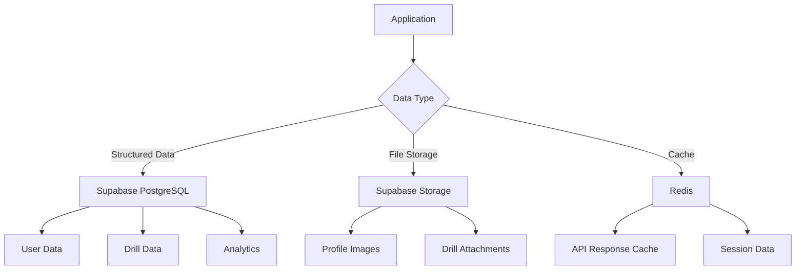

### Primary Database (Supabase PostgreSQL)

| Feature | Implementation | Justification |
|---------|----------------|---------------|
| Schema | Relational | - Complex relationships between entities<br>- ACID compliance<br>- Strong consistency |
| Scaling | Horizontal | - Read replicas for performance<br>- Connection pooling<br>- Automated backups |
| Security | Row Level | - Fine-grained access control<br>- Data isolation<br>- Audit logging |

### Caching Strategy (Redis)

| Cache Type | TTL | Purpose |
|------------|-----|---------|
| API Response | 5 min | - Reduce API calls<br>- Improve response time |
| Session | 24 hrs | - User state management<br>- Authentication data |
| Drill Data | 1 hr | - Frequently accessed content<br>- Reduce database load |

## 4.4 THIRD-PARTY SERVICES

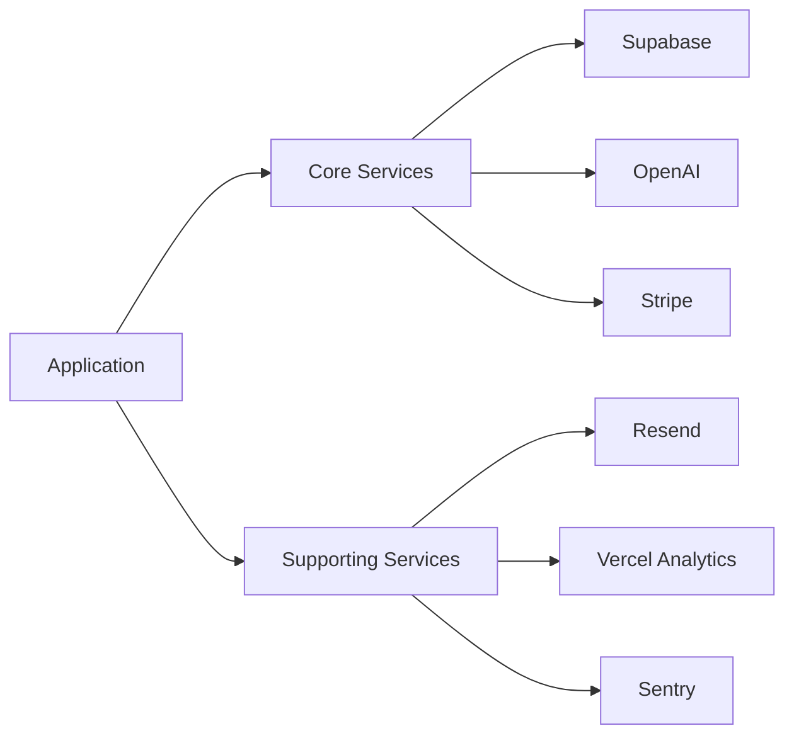

| Service | Purpose | Integration Method |
|---------|---------|-------------------|
| Supabase | Database & Auth | - SDK<br>- REST API<br>- Real-time subscriptions |
| OpenAI | AI Evaluation | - REST API<br>- Streaming responses |
| Stripe | Payments | - SDK<br>- Webhooks |
| Resend | Email | - REST API |
| Vercel Analytics | Performance | - Built-in integration |
| Sentry | Error Tracking | - SDK<br>- Source maps |

## 4.5 DEVELOPMENT & DEPLOYMENT

### Development Environment

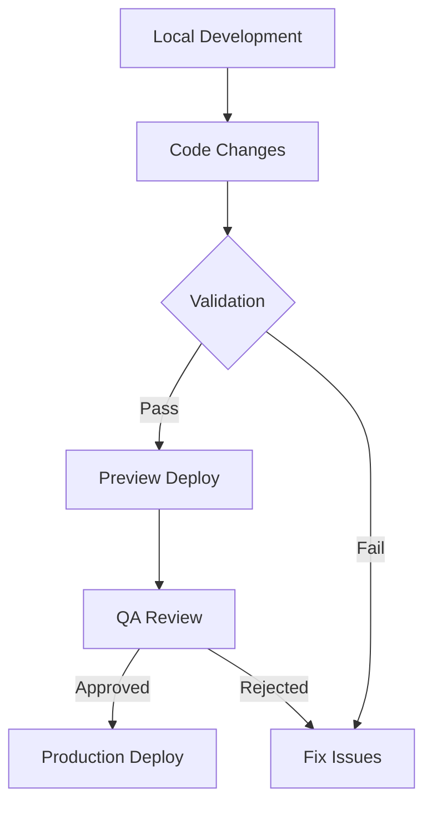

| Tool | Purpose | Configuration |
|------|---------|---------------|
| VS Code | IDE | - ESLint<br>- Prettier<br>- TypeScript |
| pnpm | Package Manager | - Workspace support<br>- Fast installation<br>- Disk efficiency |
| Jest | Testing | - Unit tests<br>- Integration tests<br>- Coverage reports |
| Playwright | E2E Testing | - Cross-browser testing<br>- Visual regression<br>- Performance testing |

### Deployment Pipeline (Vercel)

| Stage | Tools | Purpose |
|-------|-------|---------|
| Build | - Next.js build<br>- TypeScript compile | - Production optimization<br>- Type checking |
| Test | - Jest<br>- Playwright | - Automated testing<br>- Regression prevention |
| Deploy | - Vercel Platform | - Edge network distribution<br>- Zero-downtime updates |
| Monitor | - Vercel Analytics<br>- Sentry | - Performance tracking<br>- Error monitoring |

Based on the provided documentation and requirements, I'll generate the SYSTEM DESIGN section focusing on User Interface Design, Database Design, and API Design, maintaining consistency with the NextJS/React stack and other technology choices.

# 7. SYSTEM DESIGN

## 7.1 User Interface Design

### 7.1.1 Design System Specifications

| Component | Specification |
|-----------|--------------|
| Typography | - Primary: Inter<br>- Secondary: Roboto Mono<br>- Scale: 12/14/16/20/24/32/48px |
| Color Palette | - Primary: #0F172A<br>- Secondary: #3B82F6<br>- Accent: #22C55E<br>- Error: #EF4444<br>- Warning: #F59E0B |
| Spacing | - Base unit: 4px<br>- Scale: 4/8/12/16/24/32/48/64px |
| Breakpoints | - Mobile: 320px<br>- Tablet: 768px<br>- Desktop: 1024px<br>- Wide: 1440px |
| Shadows | - sm: 0 1px 2px rgba(0,0,0,0.05)<br>- md: 0 4px 6px rgba(0,0,0,0.1)<br>- lg: 0 10px 15px rgba(0,0,0,0.1) |

### 7.1.2 Component Library


### 7.1.3 Critical User Flows


### 7.1.4 Accessibility Requirements

| Category | Requirements |
|----------|--------------|
| Standards | WCAG 2.1 AA compliant |
| Keyboard | - Full keyboard navigation<br>- Focus indicators<br>- Skip links |
| Screen Readers | - ARIA labels<br>- Semantic HTML<br>- Alt text for images |
| Color | - Minimum contrast 4.5:1<br>- Color-independent information<br>- High contrast mode |

## 7.2 Database Design

### 7.2.1 Schema Design


### 7.2.2 Indexing Strategy

| Table | Index Type | Columns | Purpose |
|-------|------------|---------|----------|
| Users | B-tree | email | Login lookups |
| DrillAttempts | B-tree | (user_id, created_at) | Performance history |
| SimulationAttempts | B-tree | (user_id, success) | Success tracking |
| Feedback | GiST | response_text | Full-text search |

### 7.2.3 Partitioning Strategy

```sql
-- Partition DrillAttempts by month
CREATE TABLE drill_attempts (
    id uuid NOT NULL,
    created_at timestamp NOT NULL
) PARTITION BY RANGE (created_at);

-- Create monthly partitions
CREATE TABLE drill_attempts_y2024m01 
    PARTITION OF drill_attempts
    FOR VALUES FROM ('2024-01-01') TO ('2024-02-01');
```

## 7.3 API Design

### 7.3.1 API Architecture


### 7.3.2 Endpoint Specifications

| Endpoint | Method | Purpose | Auth Required |
|----------|--------|---------|---------------|
| /api/drills | GET | List available drills | Yes |
| /api/drills/:id | POST | Submit drill attempt | Yes |
| /api/simulation | POST | Start simulation | Yes |
| /api/feedback | GET | Retrieve feedback | Yes |

### 7.3.3 Authentication Flow


### 7.3.4 Rate Limiting

| Tier | Limit | Window | Burst |
|------|-------|--------|--------|
| Free | 60 | 1 hour | 5 |
| Basic | 300 | 1 hour | 10 |
| Premium | 1000 | 1 hour | 20 |

### 7.3.5 Error Handling

```typescript
interface APIError {
    code: string;
    message: string;
    details?: Record<string, any>;
    timestamp: string;
    requestId: string;
}

enum ErrorCodes {
    VALIDATION_ERROR = 'VALIDATION_ERROR',
    AUTHENTICATION_ERROR = 'AUTHENTICATION_ERROR',
    RATE_LIMIT_ERROR = 'RATE_LIMIT_ERROR',
    INTERNAL_ERROR = 'INTERNAL_ERROR'
}
```

### 7.3.6 Security Controls

| Control | Implementation |
|---------|----------------|
| Authentication | JWT with RSA-256 |
| Rate Limiting | Token bucket algorithm |
| Input Validation | JSON Schema validation |
| Output Sanitization | HTML escape, XSS prevention |
| CORS | Whitelist allowed origins |
| API Keys | Required for external services |

# 6. USER INTERFACE DESIGN

## 6.1 Design System

The user interface follows the NextJS/React architecture using TailwindCSS and shadcn/ui components, implementing a consistent design system across all views.

### Symbol Key
```
Navigation/Actions:    Information:         Input Elements:
[#] Dashboard         [i] Info             [...] Text input
[@] Profile           [?] Help             [ ] Checkbox
[=] Menu             [!] Alert            ( ) Radio
[<] [>] Navigate     [$] Payment          [v] Dropdown
[x] Close            [*] Important        [Button] Button
[^] Upload                                [====] Progress
```

## 6.2 Core Layouts

### 6.2.1 Main Navigation
```
+----------------------------------------------------------+
|  [#] Case Practice Platform    [@] Profile  [$] Upgrade   |
+----------------------------------------------------------+
|  +----------------+  +--------------------------------+    |
|  | [=] Menu      |  |  Welcome back, Sarah           |    |
|  | Dashboard     |  |  Interview in: 15 days         |    |
|  | Drills        |  |                                |    |
|  | Simulation    |  |  [====] 65% Complete          |    |
|  | Progress      |  |                                |    |
|  | Settings      |  |  Recent Activity:             |    |
|  +----------------+  |  - Case Math Drill (85%)      |    |
|                     |  - Market Sizing (90%)         |    |
|                     +--------------------------------+    |
+----------------------------------------------------------+
```

### 6.2.2 Drill Selection Interface
```
+----------------------------------------------------------+
|                     Practice Drills                        |
+----------------------------------------------------------+
|  Filter: [v] All Types    [v] Difficulty    [v] Industry  |
|                                                           |
|  +------------------------+  +------------------------+    |
|  | Case Prompt Drills     |  | Calculation Drills     |    |
|  | [====] 8/10 Complete   |  | [====] 5/10 Complete   |    |
|  | [Start Practice]       |  | [Start Practice]       |    |
|  +------------------------+  +------------------------+    |
|                                                           |
|  +------------------------+  +------------------------+    |
|  | Market Sizing Drills   |  | Brainstorming Drills  |    |
|  | [====] 3/10 Complete   |  | [====] 7/10 Complete   |    |
|  | [Start Practice]       |  | [Start Practice]       |    |
|  +------------------------+  +------------------------+    |
+----------------------------------------------------------+
```

### 6.2.3 Active Drill Interface
```
+----------------------------------------------------------+
|  Case Prompt: Market Entry Strategy          Time: 15:00   |
+----------------------------------------------------------+
|  [i] A European retailer is considering US market entry    |
|                                                           |
|  Your Response:                                           |
|  +--------------------------------------------------+    |
|  |                                                   |    |
|  | [...Enter your analysis here...                ] |    |
|  |                                                   |    |
|  +--------------------------------------------------+    |
|                                                           |
|  Structure:                                               |
|  ( ) Market Analysis                                      |
|  ( ) Competition                                          |
|  ( ) Entry Strategy                                       |
|  ( ) Financial Implications                               |
|                                                           |
|  [Save Draft]              [Submit Response]              |
+----------------------------------------------------------+
```

### 6.2.4 McKinsey Simulation Interface
```
+----------------------------------------------------------+
|  Ecosystem Simulation                    Time Left: 30:00  |
+----------------------------------------------------------+
|  +-------------------+  +------------------------------+   |
|  | Available Species |  | Selected Species (0/8)       |   |
|  |                   |  |                              |   |
|  | Producers:        |  | Environment Parameters:      |   |
|  | [ ] Algae         |  | Temperature: [v] 20°C        |   |
|  | [ ] Plankton      |  | Depth: [v] 50m              |   |
|  |                   |  | Salt: [v] 35cm/s            |   |
|  | Consumers:        |  |                              |   |
|  | [ ] Fish A        |  | Validation:                  |   |
|  | [ ] Fish B        |  | [!] Select 3 producers      |   |
|  | [ ] Fish C        |  | [!] Select 5 consumers      |   |
|  +-------------------+  +------------------------------+   |
|                                                           |
|  [Reset Selection]                    [Submit Ecosystem]   |
+----------------------------------------------------------+
```

### 6.2.5 Progress Dashboard
```
+----------------------------------------------------------+
|  Your Progress                       [@] Profile Settings  |
+----------------------------------------------------------+
|  Overall Completion: [========] 75%                        |
|                                                           |
|  Drill Performance:                                       |
|  +----------------------+  +-------------------------+     |
|  | Case Prompts         |  | Calculations            |     |
|  | [====] 80%          |  | [======] 90%           |     |
|  +----------------------+  +-------------------------+     |
|                                                           |
|  Recent Feedback:                                         |
|  [*] Improve market sizing assumptions                    |
|  [*] Strong framework structure                           |
|  [*] Work on calculation speed                           |
|                                                           |
|  Target Areas:                                            |
|  [v] Select skill to focus                               |
|  [Start Targeted Practice]                               |
+----------------------------------------------------------+
```

## 6.3 Responsive Behavior

The interface adapts to different screen sizes following these breakpoints:

| Breakpoint | Layout Adjustments |
|------------|-------------------|
| Mobile (<768px) | - Single column layout<br>- Collapsible menu<br>- Stacked drill cards |
| Tablet (768-1024px) | - Two column layout<br>- Visible side menu<br>- Grid drill cards |
| Desktop (>1024px) | - Full layout<br>- Persistent side menu<br>- Maximum content width |

## 6.4 Interactive Elements

All interactive elements follow shadcn/ui component specifications with consistent hover, focus, and active states:

| State | Visual Indicator |
|-------|-----------------|
| Hover | Background color shift + subtle shadow |
| Focus | Blue outline + increased shadow |
| Active | Darker background + inset shadow |
| Disabled | Reduced opacity + no hover effects |

## 6.5 Accessibility Features

- ARIA labels on all interactive elements
- Keyboard navigation support
- Screen reader optimized content flow
- Minimum contrast ratio of 4.5:1
- Focus visible indicators
- Skip navigation links
- Alt text for all visual elements

# 8. SECURITY CONSIDERATIONS

## 8.1 AUTHENTICATION AND AUTHORIZATION

### 8.1.1 Authentication Flow

```mermaid
sequenceDiagram
    participant User
    participant Client
    participant Edge
    participant Supabase
    participant Database

    User->>Client: Login Request
    Client->>Edge: Forward Credentials
    Edge->>Supabase: Authenticate
    Supabase->>Database: Verify Credentials
    Database-->>Supabase: User Found
    Supabase-->>Edge: Generate JWT
    Edge-->>Client: Set HTTP-only Cookie
    Client-->>User: Redirect to Dashboard
```

### 8.1.2 Authorization Levels

| Role | Access Level | Permissions |
|------|--------------|-------------|
| Anonymous | Public | - View landing page<br>- Access public documentation<br>- Create account |
| Free User | Basic | - Use demo features<br>- Limited drill attempts<br>- Basic progress tracking |
| Paid User | Premium | - Full platform access<br>- Unlimited drills<br>- Advanced analytics |
| Admin | System | - User management<br>- Content management<br>- System configuration |

### 8.1.3 Session Management

| Component | Implementation |
|-----------|----------------|
| Token Type | JWT with RSA-256 |
| Session Duration | 24 hours |
| Refresh Mechanism | Rolling refresh with 7-day limit |
| Cookie Settings | Secure, HTTP-only, SameSite=Strict |

## 8.2 DATA SECURITY

### 8.2.1 Data Classification

| Category | Examples | Protection Level |
|----------|----------|-----------------|
| Public | - Marketing content<br>- Public drill descriptions | Basic |
| Internal | - Usage analytics<br>- Performance metrics | Medium |
| Confidential | - User responses<br>- Payment details | High |
| Restricted | - Authentication tokens<br>- Encryption keys | Maximum |

### 8.2.2 Encryption Strategy

```mermaid
flowchart TD
    A[Data Entry] --> B{Classification}
    B -->|Public| C[No Encryption]
    B -->|Internal| D[TLS in Transit]
    B -->|Confidential| E[End-to-End]
    B -->|Restricted| F[Hardware Security]
    
    E --> G[AES-256]
    F --> H[HSM Integration]
    
    G --> I[Encrypted Storage]
    H --> I
    I --> J[Backup Encryption]
```

### 8.2.3 Key Management

| Key Type | Rotation Period | Storage |
|----------|----------------|----------|
| JWT Signing | 30 days | HSM |
| Database Encryption | 90 days | Key Vault |
| TLS Certificates | 1 year | Certificate Manager |
| API Keys | 180 days | Environment Variables |

## 8.3 SECURITY PROTOCOLS

### 8.3.1 Request Protection

```mermaid
flowchart LR
    A[Request] --> B{WAF}
    B -->|Block| C[429 Too Many Requests]
    B -->|Allow| D{Rate Limit}
    D -->|Exceed| E[503 Service Unavailable]
    D -->|Pass| F{Auth}
    F -->|Invalid| G[401 Unauthorized]
    F -->|Valid| H[Process Request]
```

### 8.3.2 Security Headers

| Header | Value | Purpose |
|--------|-------|---------|
| Content-Security-Policy | strict-dynamic | XSS Protection |
| X-Frame-Options | DENY | Clickjacking Prevention |
| X-Content-Type-Options | nosniff | MIME Sniffing Prevention |
| Strict-Transport-Security | max-age=31536000 | Force HTTPS |
| X-XSS-Protection | 1; mode=block | Browser XSS Filter |

### 8.3.3 Input Validation

| Input Type | Validation Method | Example |
|------------|------------------|---------|
| Text | Regex Pattern | `/^[a-zA-Z0-9\s]{1,500}$/` |
| Email | Format Check | RFC 5322 Standard |
| Numbers | Range Validation | `min/max bounds` |
| Files | MIME Verification | Allowed types only |

### 8.3.4 Monitoring and Response

```mermaid
flowchart TD
    A[Security Event] --> B{Severity}
    B -->|Low| C[Log Event]
    B -->|Medium| D[Alert Team]
    B -->|High| E[Automatic Response]
    
    C --> F[Daily Review]
    D --> G[Investigate]
    E --> H[Block Source]
    
    G --> I[Update Rules]
    H --> I
    I --> J[Document Incident]
```

### 8.3.5 Compliance Requirements

| Standard | Requirements | Implementation |
|----------|--------------|----------------|
| GDPR | Data Protection | - Encryption at rest<br>- Access controls<br>- Data deletion capability |
| PCI DSS | Payment Security | - Tokenization<br>- Audit logging<br>- Secure transmission |
| SOC 2 | System Security | - Access review<br>- Change management<br>- Incident response |
| CCPA | Privacy Rights | - Data inventory<br>- Consent management<br>- Access requests |

### 8.3.6 Security Testing

| Test Type | Frequency | Tools |
|-----------|-----------|-------|
| Penetration Testing | Quarterly | Burp Suite, OWASP ZAP |
| Vulnerability Scanning | Weekly | Snyk, SonarQube |
| Dependency Audit | Daily | npm audit, Dependabot |
| Security Review | Monthly | Manual code review |

# 9. INFRASTRUCTURE

## 9.1 DEPLOYMENT ENVIRONMENT

The Case Interview Practice Platform utilizes a cloud-native architecture deployed exclusively on Vercel's Edge Network.

| Environment | Purpose | Configuration |
|-------------|---------|---------------|
| Development | Local development and testing | - Local NextJS server<br>- Local Supabase instance<br>- Stripe test environment |
| Staging | Pre-production testing | - Vercel Preview Deployments<br>- Staging Supabase instance<br>- Stripe test environment |
| Production | Live application | - Vercel Production<br>- Production Supabase<br>- Stripe production environment |

### Environment Distribution

```mermaid
flowchart TD
    A[Global Traffic] --> B[Vercel Edge Network]
    B --> C{Geographic Region}
    C --> D[North America Edge]
    C --> E[Europe Edge]
    C --> F[Asia Edge]
    D & E & F --> G[Nearest Edge Function]
    G --> H{Request Type}
    H -->|Static| I[CDN Cache]
    H -->|Dynamic| J[Edge Function]
    J --> K[Supabase]
```

## 9.2 CLOUD SERVICES

| Service | Provider | Purpose | Justification |
|---------|----------|---------|---------------|
| Edge Hosting | Vercel | Application hosting and edge functions | - Native NextJS support<br>- Global edge network<br>- Automatic scaling |
| Database | Supabase | Data storage and real-time subscriptions | - PostgreSQL compatibility<br>- Built-in auth<br>- Real-time capabilities |
| File Storage | Supabase Storage | User uploads and static assets | - Integrated with database<br>- Simple API<br>- Cost-effective |
| CDN | Vercel Edge Network | Static content delivery | - Automatic optimization<br>- Global distribution<br>- Zero configuration |
| Email | Resend | Transactional emails | - Modern API<br>- High deliverability<br>- Analytics |

### Service Architecture

```mermaid
graph TD
    A[Vercel Edge Network] --> B[Edge Functions]
    A --> C[Static Assets]
    B --> D[Supabase]
    D --> E[PostgreSQL]
    D --> F[Storage]
    B --> G[OpenAI]
    B --> H[Stripe]
    B --> I[Resend]
```

## 9.3 CONTAINERIZATION

The platform utilizes containerization selectively for development and testing environments only.

### Development Containers

| Container | Purpose | Configuration |
|-----------|---------|---------------|
| Supabase Local | Local development database | - PostgreSQL 14<br>- PostgREST<br>- GoTrue auth |
| Redis | Local caching | - Redis 6<br>- 2GB memory limit |
| Mailhog | Email testing | - SMTP server<br>- Web interface |

```mermaid
graph LR
    A[Docker Compose] --> B[Supabase Local]
    A --> C[Redis]
    A --> D[Mailhog]
    B --> E[Local NextJS]
    C --> E
    D --> E
```

## 9.4 ORCHESTRATION

The platform leverages Vercel's built-in orchestration capabilities rather than using traditional container orchestration.

| Feature | Implementation | Purpose |
|---------|----------------|----------|
| Auto-scaling | Vercel Serverless | - Automatic function scaling<br>- Load balancing<br>- Zero-downtime updates |
| Edge Distribution | Vercel Edge Network | - Global deployment<br>- Regional failover<br>- Traffic routing |
| Health Checks | Vercel Monitoring | - Function health<br>- Performance metrics<br>- Error tracking |

## 9.5 CI/CD PIPELINE

### Pipeline Overview

```mermaid
flowchart TD
    A[Code Push] --> B{Branch Type}
    B -->|Feature| C[Preview Build]
    B -->|Main| D[Production Build]
    
    C --> E[Run Tests]
    D --> E
    
    E --> F{Tests Pass?}
    F -->|No| G[Notify Team]
    F -->|Yes| H[Deploy Preview]
    
    H --> I{Production?}
    I -->|No| J[Preview URL]
    I -->|Yes| K[Production Deploy]
    
    K --> L[Post-Deploy Tests]
    L --> M[Monitor Metrics]
```

### Pipeline Stages

| Stage | Tools | Actions |
|-------|-------|---------|
| Code Quality | - ESLint<br>- Prettier<br>- TypeScript | - Lint checking<br>- Code formatting<br>- Type checking |
| Testing | - Jest<br>- Playwright<br>- MSW | - Unit tests<br>- Integration tests<br>- E2E tests |
| Build | - Next.js build<br>- Webpack<br>- SWC | - Code compilation<br>- Asset optimization<br>- Bundle analysis |
| Deploy | - Vercel CLI<br>- GitHub Actions | - Environment deployment<br>- Configuration updates<br>- Cache invalidation |
| Monitoring | - Vercel Analytics<br>- Sentry | - Performance tracking<br>- Error monitoring<br>- Usage analytics |

### Deployment Configuration

```yaml
# vercel.json
{
  "version": 2,
  "builds": [
    {
      "src": "package.json",
      "use": "@vercel/next"
    }
  ],
  "routes": [
    {
      "src": "/api/(.*)",
      "dest": "/api/$1",
      "headers": {
        "Cache-Control": "s-maxage=0"
      }
    },
    {
      "src": "/(.*)",
      "dest": "/$1",
      "headers": {
        "Cache-Control": "s-maxage=3600"
      }
    }
  ]
}
```

### Deployment Environments

| Environment | Trigger | Validation | Post-Deploy |
|-------------|---------|------------|-------------|
| Preview | Pull Request | - Unit tests<br>- Integration tests<br>- Lighthouse scores | - E2E tests<br>- Manual QA |
| Staging | Main Branch Push | - Full test suite<br>- Performance tests<br>- Security scan | - Smoke tests<br>- Integration verification |
| Production | Release Tag | - All previous tests<br>- Load testing<br>- Security audit | - Synthetic monitoring<br>- Error tracking |

# APPENDICES

## A. GLOSSARY

| Term | Definition |
|------|------------|
| Case Interview | A job interview focused on analyzing and solving business problems in real-time |
| Drill | A focused practice exercise targeting specific case interview skills |
| MECE | Mutually Exclusive, Collectively Exhaustive - a problem-solving framework |
| Market Sizing | Estimation technique to determine total market value or volume |
| Break Even | Point at which total revenue equals total costs |
| Case Math | Quantitative analysis specific to business case scenarios |
| Synthesizing | Process of combining information to form coherent conclusions |
| Food Chain | Hierarchical relationship between species in ecosystem simulation |

## B. ACRONYMS

| Acronym | Expansion |
|---------|-----------|
| API | Application Programming Interface |
| CCPA | California Consumer Privacy Act |
| CORS | Cross-Origin Resource Sharing |
| CQRS | Command Query Responsibility Segregation |
| GDPR | General Data Protection Regulation |
| JWT | JSON Web Token |
| MECE | Mutually Exclusive, Collectively Exhaustive |
| ORM | Object-Relational Mapping |
| PCI DSS | Payment Card Industry Data Security Standard |
| SQL | Structured Query Language |
| SRS | Software Requirements Specification |
| TLS | Transport Layer Security |
| TTL | Time To Live |
| UI | User Interface |
| WCAG | Web Content Accessibility Guidelines |
| WSS | WebSocket Secure |
| YoY | Year over Year |

## C. ADDITIONAL REFERENCES

### Technical Documentation

| Resource | Purpose |
|----------|----------|
| [NextJS Documentation](https://nextjs.org/docs) | Framework reference |
| [Supabase Documentation](https://supabase.io/docs) | Database and authentication |
| [Stripe API Reference](https://stripe.com/docs/api) | Payment integration |
| [OpenAI API Documentation](https://platform.openai.com/docs) | AI integration |
| [Shadcn Documentation](https://ui.shadcn.com) | UI components |

### Business References

| Resource | Purpose |
|----------|----------|
| McKinsey Digital Assessment Guide | Simulation reference |
| Case Interview Frameworks | Drill structure reference |
| Consulting Math Guidelines | Calculation drill reference |
| Market Sizing Methodologies | Market sizing drill reference |

## D. IMPLEMENTATION NOTES

### Development Environment Setup

```bash
# Required environment variables
NEXT_PUBLIC_SUPABASE_URL=
NEXT_PUBLIC_SUPABASE_ANON_KEY=
STRIPE_SECRET_KEY=
OPENAI_API_KEY=
RESEND_API_KEY=

# Development commands
npm run dev     # Start development server
npm run build   # Production build
npm run test    # Run test suite
```

### Database Initialization

```sql
-- Core tables initialization
CREATE TABLE users (
  id UUID PRIMARY KEY DEFAULT uuid_generate_v4(),
  email TEXT UNIQUE NOT NULL,
  created_at TIMESTAMP WITH TIME ZONE DEFAULT TIMEZONE('utc'::text, NOW())
);

CREATE TABLE subscriptions (
  id UUID PRIMARY KEY DEFAULT uuid_generate_v4(),
  user_id UUID REFERENCES users(id),
  stripe_subscription_id TEXT UNIQUE,
  created_at TIMESTAMP WITH TIME ZONE DEFAULT TIMEZONE('utc'::text, NOW())
);
```

### API Rate Limits

| Service | Free Tier | Paid Tier |
|---------|-----------|------------|
| OpenAI | 3 requests/minute | 60 requests/minute |
| Drill Attempts | 2 per type | Unlimited |
| Simulation | Demo version only | Full version |