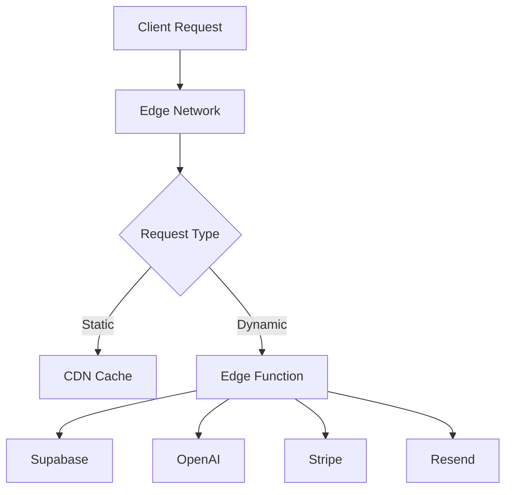

# Case Interview Practice Platform Backend

> A NextJS-based serverless backend with edge functions for case interview practice platform

## 🔍 Human Tasks

- [ ] Create a Supabase project and configure environment variables
- [ ] Set up Stripe account and configure webhook endpoints
- [ ] Configure OpenAI API access and rate limits
- [ ] Set up Resend account for transactional emails
- [ ] Configure domain and SSL certificates in Vercel

## 🚀 Project Overview

The Case Interview Practice Platform backend is a high-performance, serverless application built with NextJS 13+ and TypeScript 5.0+. It powers an AI-driven evaluation system for case interview practice, featuring real-time drill execution, McKinsey simulation engine, and comprehensive performance analytics.

Key Features:
- AI-powered evaluation system using OpenAI API
- Real-time drill execution with edge functions
- McKinsey simulation engine
- Subscription management via Stripe
- Performance analytics with Supabase
- Transactional emails using Resend

## 🛠 Getting Started

### Prerequisites

- Node.js >= 18.0.0 LTS
- pnpm >= 8.0.0
- TypeScript ^5.0.0

### Environment Setup

Create a `.env.local` file with the following variables:

```env
NEXT_PUBLIC_SUPABASE_URL=your_supabase_project_url
NEXT_PUBLIC_SUPABASE_ANON_KEY=your_supabase_anon_key
OPENAI_API_KEY=your_openai_api_key
STRIPE_SECRET_KEY=your_stripe_secret_key
RESEND_API_KEY=your_resend_api_key
```

### Installation

```bash
# Install dependencies
pnpm install

# Start development server
pnpm dev

# Build for production
pnpm build

# Start production server
pnpm start
```

## 🏗 Architecture

The backend follows a serverless architecture leveraging NextJS 13+ App Router and Edge Functions for optimal performance and scalability.

### Core Components



### Key Services

- **Edge Functions**: Handle API requests with minimal latency
- **Supabase**: Database and authentication
- **OpenAI**: AI-powered response evaluation
- **Stripe**: Subscription and payment processing
- **Resend**: Transactional email delivery

## 💻 Development

### Project Structure

```
src/backend/
├── app/              # Next.js 13 App Router
├── components/       # Shared components
├── lib/             # Core libraries
├── models/          # Data models
├── services/        # Business logic
├── types/           # TypeScript types
└── utils/           # Utility functions
```

### Available Scripts

```bash
# Development
pnpm dev             # Start development server
pnpm lint           # Run ESLint
pnpm lint:fix       # Fix ESLint issues
pnpm type-check     # Run TypeScript compiler check

# Testing
pnpm test           # Run test suite
pnpm test:watch     # Run tests in watch mode
pnpm test:coverage  # Generate coverage report

# Production
pnpm build          # Build production application
pnpm start          # Start production server
```

## 📚 API Documentation

### Authentication

All API endpoints require authentication using JWT tokens provided by Supabase Auth.

```typescript
// Authentication header format
Authorization: Bearer <jwt_token>
```

### Core Endpoints

#### Drills API

```typescript
// Get available drills
GET /api/drills

// Submit drill attempt
POST /api/drills/:id/attempt
Content-Type: application/json

{
  "response": string,
  "timeSpent": number,
  "structureType": string
}
```

#### Simulation API

```typescript
// Start simulation
POST /api/simulation/start
Content-Type: application/json

{
  "environment": string,
  "species": string[],
  "parameters": {
    "temperature": number,
    "depth": number,
    "salinity": number
  }
}
```

#### Analytics API

```typescript
// Get user performance
GET /api/analytics/performance

// Get drill statistics
GET /api/analytics/drills/:id/stats
```

## 🚀 Deployment

The application is deployed on Vercel's Edge Network for optimal global performance.

### Deployment Process

1. Push to `main` branch triggers automatic deployment
2. Vercel runs build process and executes tests
3. Successful builds are deployed to production
4. Edge functions are distributed globally

### Environment Configuration

```bash
# Production environment variables in Vercel
NEXT_PUBLIC_SUPABASE_URL=
NEXT_PUBLIC_SUPABASE_ANON_KEY=
OPENAI_API_KEY=
STRIPE_SECRET_KEY=
RESEND_API_KEY=
```

### Monitoring

- Vercel Analytics for performance monitoring
- Sentry for error tracking
- Supabase monitoring for database performance
- Custom logging for business metrics

## 🔒 Security

- All endpoints protected with JWT authentication
- Rate limiting implemented per user
- Input validation using Zod schemas
- CORS configuration for allowed origins
- HTTP-only cookies for session management
- Regular security audits and penetration testing

## 📈 Performance

- Edge functions ensure <100ms response times
- Global CDN distribution
- Optimized database queries
- Response caching strategy
- Real-time updates via WebSocket
- Automatic scaling based on load

## 🤝 Contributing

1. Fork the repository
2. Create a feature branch
3. Commit your changes
4. Push to the branch
5. Create a Pull Request

## 📝 License

Copyright © 2024 Case Interview Practice Platform. All rights reserved.